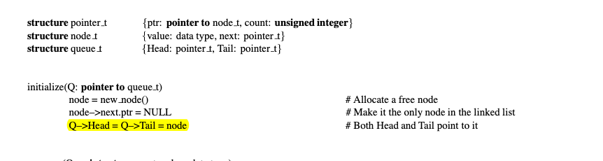
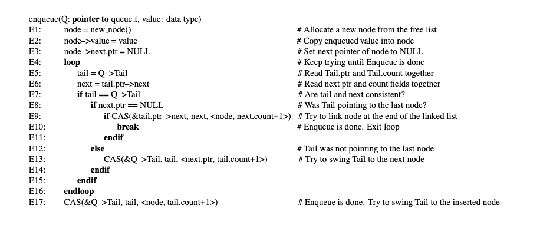
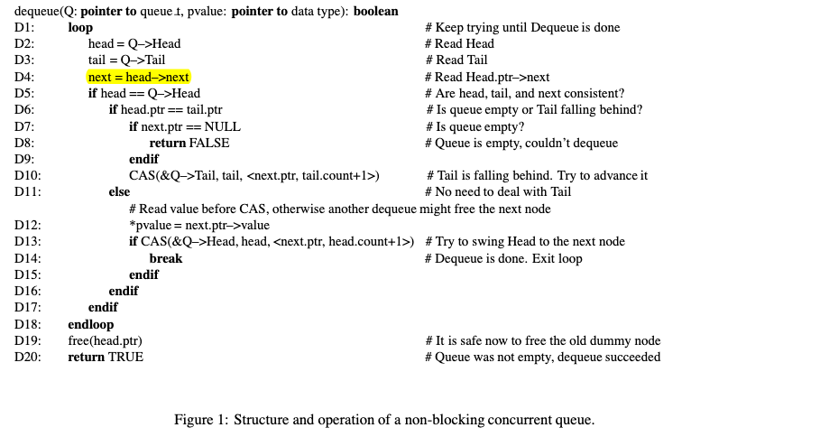

#  go实现并发队列并且基于并发队列实现一个协程池

## 并发队列
并发队列可以使用在很多多线程的场景下，每种语言都有自己的各自的标准的实现或者是第三方的实现，例如jdk的`concurrentLinkList`等，
并发队列可以帮助我们在多线程的环境下，保持插入一次和消费一次，在消费和生产的模式下或者是一些需要池化的情况下，并发队列都是一种很好的缓冲结构。
实现一个并发队列其实已经有很经典的算法了，Lock-free的算法在80年代就已经在论文中得到提出，下面是它的伪代码，这种是基于cas的情况去实现的，如果有不了解cas的同学，可以去自行了解一下，
cas是一种提供高性能多线程下原子修改变量的方式，可以做到原语级别，但是唯一的代价就是消耗cpu进行空转,但好处是不需要加锁，是一种乐观锁的实现，cas(compare and swap: 比较并交换，是原子操作的一种，可用于在多线程编程中实现不被打断的数据交换操作，从而避免多线程同时改写某一数据时由于执行顺序不确定性以及中断的不可预知性产生的数据不一致问题。 该操作通过将内存中的值与指定数据进行比较，当数值一样时将内存中的数据替换为新的值)
```c
int cas(long *addr, long old, long new)
{
    /* Executes atomically. */
    if(*addr != old)
        return 0;
    *addr = new;
    return 1;
}
```



然后论文中还有一种双锁的方式，其实就是锁住头或者尾进行插入或者出列

### cas版实现(具体思路写在代码注释中)
```go
var _ Queue = (*DefaultTaskQueue)(nil)

type Queue interface {
	Poll() interface{}
	Offer(v interface{})
}

type node struct {
	Next  unsafe.Pointer
	Value interface{}
}

func NewDefaultTaskQueue() *DefaultTaskQueue {
	node := &node{
		Next:  nil,
		Value: nil,
	}
	return &DefaultTaskQueue{
		Head: unsafe.Pointer(node),
		Tail: unsafe.Pointer(node),
	}
}

// DefaultTaskQueue DefaultTaskQueue: lock-free的数据结构
type DefaultTaskQueue struct {
	Head unsafe.Pointer // 头结点
	Tail unsafe.Pointer // 尾节点
}

// load: 加载这个指针的值
func load(p *unsafe.Pointer) *node {
	return (*node)(atomic.LoadPointer(p))
}

// cas: go的cas实现
func cas(p *unsafe.Pointer, old, new *node) bool {
	return atomic.CompareAndSwapPointer(p, unsafe.Pointer(old), unsafe.Pointer(new))
}

func (d *DefaultTaskQueue) Offer(v interface{}) {
	// 创建要插入的Node节点
	node := &node{
		Next:  nil,
		Value: v,
	}
	// cas不能确保一次成功，所以需要不断轮训去获取最新的tail
	for {
		// 拿到tail和head
		tail := load(&d.Tail)
		next := load(&tail.Next)
		// 如果此时的tail和我们获取的tail相等的情况下,即其他线程还没有插入新的节点到tail中
		if tail == load(&d.Tail) {
			// 再次确认tail的next没有任何插入
			if next == nil {
				// 尝试node插入到tail.Next中,cas的定义可以参考上面的wiki的c实现，原理是一样的
				// 尝试插入失败就证明tail.Next已经有别的协程插入了，所以重新循环获取最新值
				if cas(&tail.Next, next, node) {
					// 插入成功后，将队列struct的tail替换成node节点，然后插入成功返回
					cas(&d.Tail, tail, node)
					return
				}
			} else {
				// next != nil 即表示有节点已经入队了，需要更新尾部，不需要确认更新是否成功，
				//因为有其他协程也会进行这一步，下几次for循环后就会更新掉，我们这个插入过程就能获取到最新的尾部了
				cas(&d.Tail, tail, next)
			}
		}
	}
}

func (d *DefaultTaskQueue) Poll() interface{} {
	for {
		// 获取head和tail，以及我们需要出列的节点
		tail := load(&d.Tail)
		head := load(&d.Head)
		next := load(&head.Next)
		// 确保当前head和队列的head还是一样，即还没有其他协程弹出的节点
		if head == load(&d.Head) {
			// 空队列的情况
			if head == tail {
				// 空队列直接返回nil
				if next == nil {
					return nil
				}
				// next != nil 即代表有插入的情况在另一个协程发生了，所以需要更新一下尾部的节点，
				//不需要确保更新成功，然后进行下一次循环，获取最新头尾节点
				cas(&d.Tail, tail, next)
			} else {
				// 不是空队列，将next中的值提出，然后释放掉value的内存空间
				cur := next.Value
				next.Value = nil
				// 将head尝试更新成next,因为出列了一个节点，自然要往后挪，如果失败了，就需要重新循环获取最新值，因为有其他协程已经弹出这个节点
				if cas(&d.Head, head, next) {
					// 替换成功即返回
					return cur
				}
			}
		}
	}
}
```

### 双锁的实现

```go
type Node struct {
    Next *Node
    Val  interface{}
}

type TwoLockQueue struct {
	HeadLock *sync.Mutex
	TailLock *sync.Mutex
	Head     *Node
	Tail     *Node
}

func (t *TwoLockQueue) Offer(v interface{}) {
	node := &Node{
		Next: nil,
		Val:  v,
	}
	// 尾结点锁锁住尾结点然后插入
	t.TailLock.Lock()
	defer t.TailLock.Unlock()
	t.Tail.Next = node
	t.Tail = t.Tail.Next
}

func (t *TwoLockQueue) Poll() interface{} {
	// 头结点锁锁住头结点，然后出列
	t.HeadLock.Lock()
	defer t.HeadLock.Unlock()
	if t.Head.Next == nil {
		return nil
	}
	cur := t.Head.Next.Val
	t.Head.Next.Val = nil
	t.Head = t.Head.Next
	return cur
}
```

### 单锁实现（简单粗暴）

```go
type LockQueue struct {
	lock *sync.Mutex
	q    []interface{}
}

func (l *LockQueue) Offer(v interface{}) {
	l.lock.Lock()
	defer l.lock.Unlock()
	l.q = append(l.q, v)
}

func (l *LockQueue) Poll() interface{} {
	l.lock.Lock()
	defer l.lock.Unlock()
	if len(l.q) == 0 {
		return nil
	}
	cur := l.q[0]
	l.q = l.q[1:]
	return cur
}

```

### 下面对这3种看一下benchmark

```go
func TestQueue(t *testing.T) {
	current := &node{
		Next:  nil,
		Value: nil,
	}
	queue_cas := DefaultTaskQueue{
		Head: unsafe.Pointer(current),
		Tail: unsafe.Pointer(current),
	}
	node := &Node{
		Next: nil,
		Val:  nil,
	}
	queue_two_lock := TwoLockQueue{
		HeadLock: &sync.Mutex{},
		TailLock: &sync.Mutex{},
		Head:     node,
		Tail:     node,
	}
	queue_one_lock := LockQueue{
		lock: &sync.Mutex{},
		q:    []interface{}{},
	}
	benchmarkOffer("cas", &queue_cas, t)
	benchmarkOffer("two_lock", &queue_two_lock, t)
	benchmarkOffer("one_lock", &queue_one_lock, t)
	benchmarkPoll("cas", &queue_cas, t)
	benchmarkPoll("two_lock", &queue_two_lock, t)
	benchmarkPoll("one_lock", &queue_one_lock, t)
}

func benchmarkOffer(queueName string, q Queue, t *testing.T) {
	wait := sync.WaitGroup{}
	wait.Add(10000)
	start := time.Now()
	for i := 0; i < 10000; i++ {
		go func() {
			q.Offer("test")
			wait.Done()
		}()
	}
	t.Logf("%s add 10000 item use %v\n", queueName, time.Now().Sub(start))

}

func benchmarkPoll(queueName string, q Queue, t *testing.T) {
	wait := sync.WaitGroup{}
	wait.Add(10000)
	start := time.Now()
	for i := 0; i < 10000; i++ {
		go func() {
			for {
				if q.Poll() == nil {
					continue
				}
				wait.Done()
				break
			}
		}()
	}
	t.Logf("%s poll 10000 item use %v\n", queueName, time.Now().Sub(start))

}
```
在1W个str的插入和弹出的结果中，综合起来看是cas的会比较好，但这个benchmark有点不太严谨，毕竟是插入和弹出单独计算的开销
在插入和弹出并发的情况下，可能单锁的情况不会比双锁差，但这个测试中，双锁的弹出确实有点慢（如果有问题轻喷）
```go
=== RUN   TestQueue
    queue_test.go:51: cas add 10000 item use 2.602625ms
    queue_test.go:51: two_lock add 10000 item use 2.527625ms
    queue_test.go:51: one_lock add 10000 item use 3.517042ms
    queue_test.go:70: cas poll 10000 item use 2.8825ms
    queue_test.go:70: two_lock poll 10000 item use 947.829083ms
    queue_test.go:70: one_lock poll 10000 item use 8.845958ms
--- PASS: TestQueue (0.97s)
PASS
```

## 基于cas的lock_free队列实现一个线程池
为什么go在如此简单的创建协程的情况下还需要使用协程池呢，协程池还是可以保证协程不会重复的创建和回收，也可以保证不会存在协程泄漏的问题，导致go的程序存在内存泄露，最后出现问题（反正对速度没这么极致的要求下，使用协程池是一种很好的选择）

线程池的逻辑大概如下描述
```go
插入任务分为2种情况：
    1. 当协程池还有协程空闲的情况下，直接使用协程池的协程池进行任务执行
    2. 当协程池没有协程空闲的情况下，将任务先放入任务队列中等待主协程的调度
主协程：
    不断轮训任务队列，获取到的任务放入空闲的协程中，或者自己执行
```
我们控制协程的执行，使用channel去控制，多余的任务会放在上文实现的并发队列中
下面直接上代码

```go
package user_thread_pool

import (
	"log"
	"sync"
)

var exe Executor = initExecutor()

func Submit(task Task) {
	// 对外暴露的Submit接口
	exe.Submit(task)
}

type Task func()

type Executor struct {
	tasks chan Task
	once  *sync.Once
	queue Queue
}

func initExecutor() Executor {
	executor := newExecutor()
	// 控制初始化执行一次
	executor.once.Do(func() {
		executor.execute()
		// 启动主协程，负责调度其他协程的任务
		go executor.Run()
	})
	return executor
}

func newExecutor() Executor {
	return Executor{
		tasks: make(chan Task, 100),
		once:  &sync.Once{},
		queue: NewDefaultTaskQueue(),
	}
}

// Submit Submit: 提交任务，如果有空闲协程则添加到空闲协程执行，否则添加到任务队列中
func (e *Executor) Submit(task Task) {
	select {
	case e.tasks <- task:
		return
	default:
		e.queue.Offer(task)
	}
}

// Run Run: 主协程负责调度任务，如果有空闲协程则添加到协程中执行，否则就自己执行
func (e *Executor) Run() {
	for {
		task := e.queue.Poll()
		if task == nil {
			continue
		}
		select {
		case e.tasks <- task.(Task):
			continue
		default:
			log.Println("thread_pool_master run task!")
			task.(Task)()
		}
	}
}

// execute execute: 创建协程池的初始协程，不断地轮训任务，不存在任务的时候会阻塞该协程
func (e *Executor) execute() {
	for i := 0; i < 8; i++ {
		go func(threadId int) {
			for {
				t := <-e.tasks
				log.Printf("thread_pool_%d run task!\n", threadId)
				t()
			}
		}(i)
	}
}
```
下面进行一次测试，与直接go启动协程执行任务的时间开销做比较（结果被吊打）
```go
package user_thread_pool

import (
	"sync"
	"testing"
	"time"
)


func TestSubmit(t *testing.T) {
	group := sync.WaitGroup{}
	group.Add(1000000)
	start := time.Now()
	for i := 0; i < 1000000; i++ {
		cur := i
		Submit(func() {
			t.Logf("run %d\n", cur)
			group.Done()
		})
	}
	group.Wait()
	t.Logf("end start in %v", time.Now().Sub(start))
}

func TestSubmit1(t *testing.T) {
	group := sync.WaitGroup{}
	group.Add(1000000)
	start := time.Now()
	for i := 0; i < 1000000; i++ {
		cur := i
		go func() {
			t.Logf("run %d\n", cur)
			group.Done()
		}()
	}
	group.Wait()
	t.Logf("end start in %v", time.Now().Sub(start))
}

```
跑出来的结果对比
```go
协程池 end start in 17.942230416s
直接创建协程 end start in 10.029664708s
```

参考文章

[lock_free paper](https://www.cs.rochester.edu/~scott/papers/1996_PODC_queues.pdf)

[wiki cas的解释](https://zh.wikipedia.org/zh-cn/%E6%AF%94%E8%BE%83%E5%B9%B6%E4%BA%A4%E6%8D%A2)

[实现lockfree](https://colobu.com/2020/08/14/lock-free-queue-in-go/)